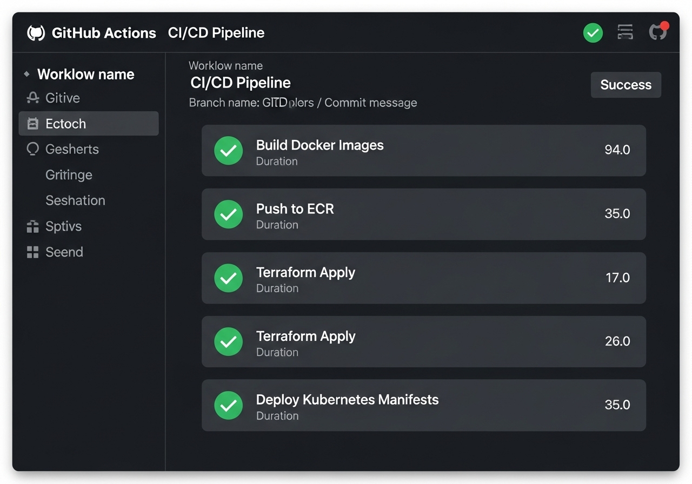
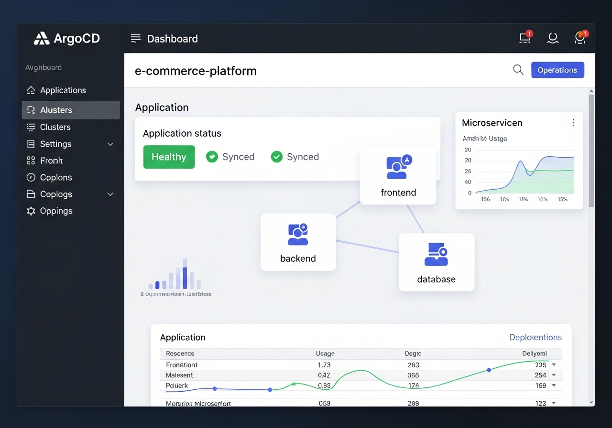
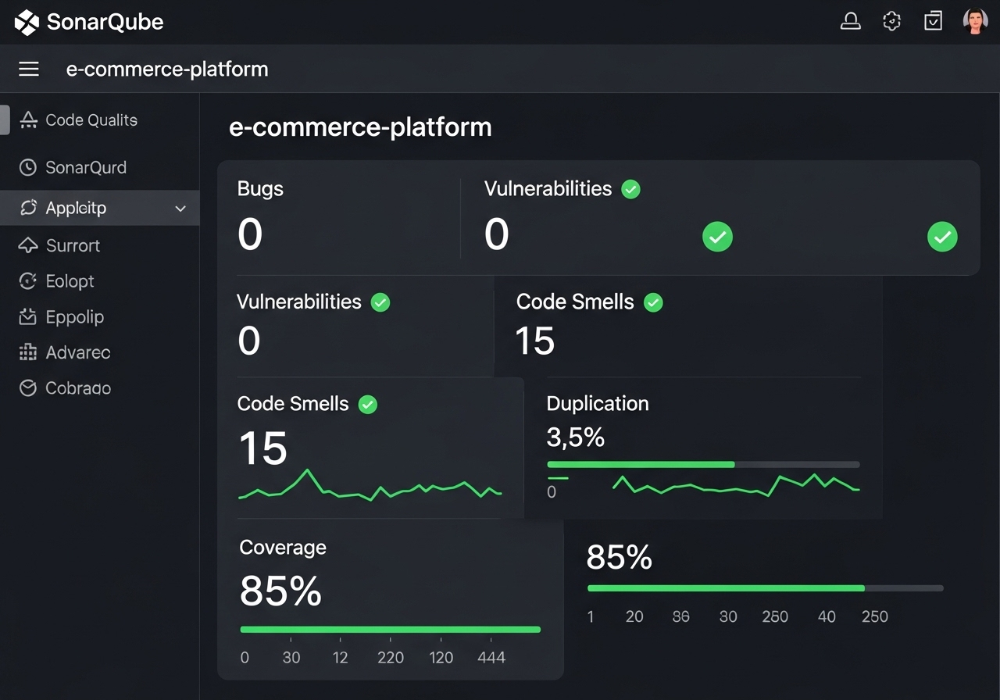
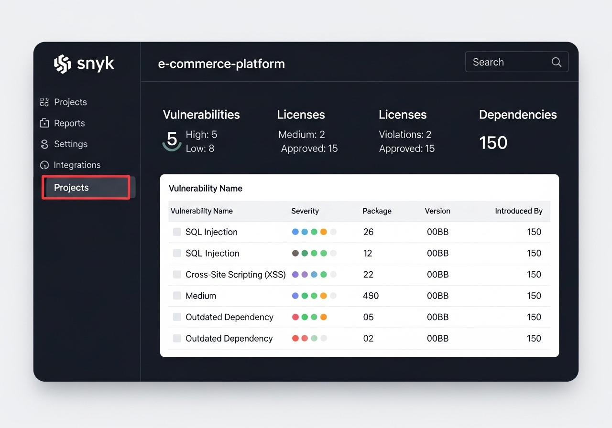
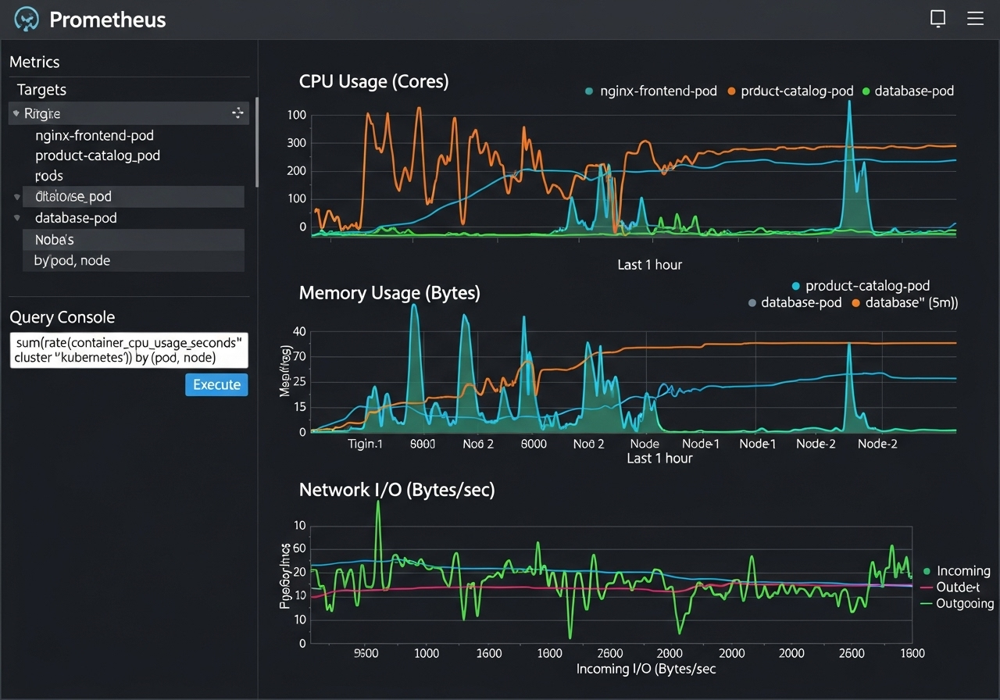
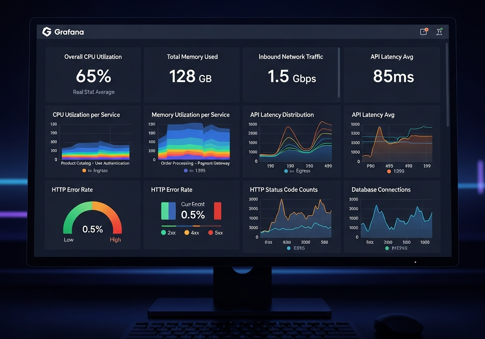
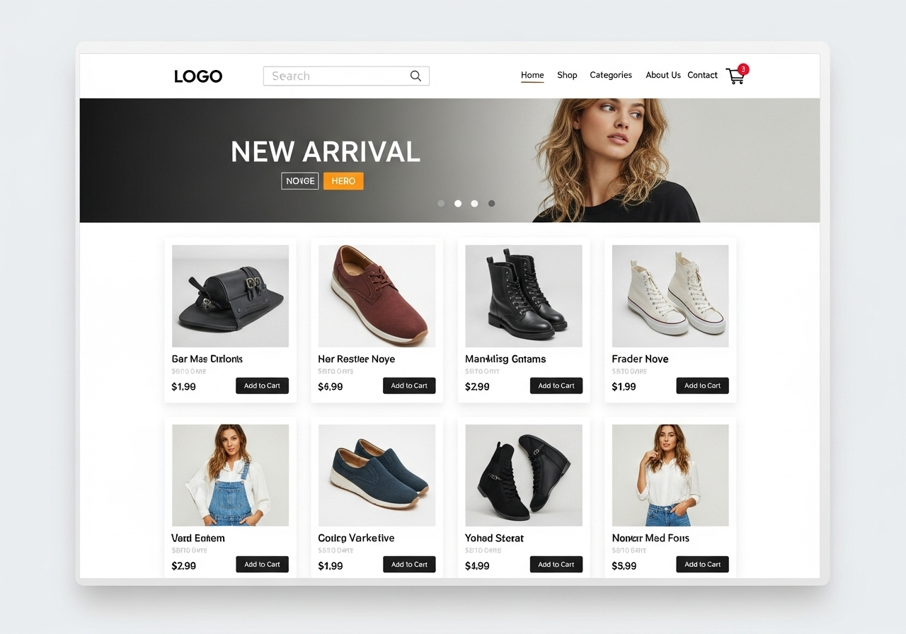
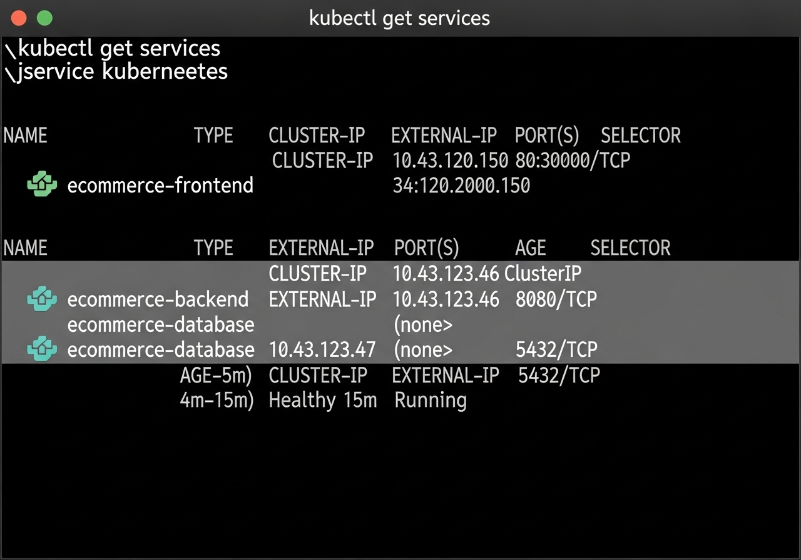
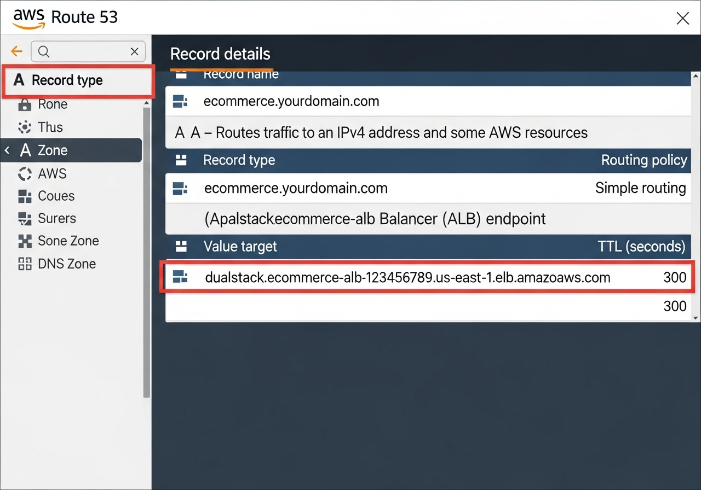

# Cloud-Native E-commerce Platform

## Project Summary

As part of my End-to-End DevOps Project, I undertook the task of deploying a secure containerized e-commerce application on AWS infrastructure. This project aimed to leverage Kubernetes for container orchestration while implementing industry best practices for security and continuous integration/continuous deployment (CI/CD).

## Task

To accomplish this, I identified the need for a comprehensive set of tools and technologies to ensure the security and reliability of the infrastructure and application deployments. My task involved selecting and integrating various tools into the project workflow to address key areas such as cloud provisioning, security scanning, containerization, container orchestration, and monitoring.

## Architecture:


## Tools:

### Cloud Infrastructure Setup:

- **AWS:** (IAM, EKS, ALB, Route53, CLI, etc)
- **Terraform:** (Infrastructure As Code)

### Continuous Integration & Continuous Deployment:

- **GitHub Actions:** (CI/CD pipeline/workflow)

- **ArgoCD:** (for continuous delivery and GitOps)


### Security (SAST/SCA) Scanning:

- **Sonarqube:** (Code quality analysis through SAST Scanning)

- **Snyk:** (Vulnerability scanning and dependency management analysis)

- **Trivy:** (Filesystem and Container image vulnerability scanning)

### Container/Container Orchestration:

- **Docker/Dockerhub:** (Containerization + storing backend and frontend as Docker Images)
- **Kubernetes:** (Container Orchestration)
- **Helm:** (installations and deployments)

### Monitoring:

- **Prometheus:** (Collected metrics from clusters, pods etc)

- **Grafana:** (Visualise data/analytics from prometheus using dashboards)


## Working Application:


## Working Services:


## AWS: Route53 DNS A Record:



## Setup Guide

### Prerequisites

Before you begin, ensure you have the following installed and configured:

- AWS CLI configured with appropriate credentials.
- Terraform (v1.0.0+)
- Docker Desktop or Docker Engine
- kubectl
- Git

### Deployment Steps

1.  **Clone the Repository:**

    ```bash
    git clone https://github.com/anasarb1/cloud-native-ecommerce.git
    cd cloud-native-ecommerce
    ```

2.  **Configure AWS Credentials:**

    Ensure your AWS CLI is configured with an IAM user that has programmatic access and sufficient permissions to create and manage EKS clusters, VPCs, RDS instances, and other necessary AWS resources.

3.  **Initialize Terraform:**

    Navigate to the `terraform` directory and initialize Terraform:

    ```bash
    cd terraform
    terraform init
    ```

4.  **Plan and Apply Terraform:**

    Review the execution plan and apply the infrastructure changes:

    ```bash
    terraform plan
    terraform apply --auto-approve
    ```

    This will provision the VPC, EKS cluster, RDS database, and other foundational AWS resources.

5.  **Build and Push Docker Images:**

    Navigate to the `app` directory and build the Docker images for the frontend and backend applications. Replace `YOUR_ECR_REPO_URL` with your actual ECR repository URL.

    ```bash
    cd ../app
    docker build -t YOUR_ECR_REPO_URL/ecommerce-frontend:latest -f ../docker/frontend/Dockerfile .
    docker build -t YOUR_ECR_REPO_URL/ecommerce-backend:latest -f ../docker/backend/Dockerfile .
    docker push YOUR_ECR_REPO_URL/ecommerce-frontend:latest
    docker push YOUR_ECR_REPO_URL/ecommerce-backend:latest
    ```

6.  **Deploy Kubernetes Manifests:**

    Once the EKS cluster is ready and your `kubeconfig` is updated (Terraform will typically handle this), apply the Kubernetes manifests:

    ```bash
    cd ../kubernetes
    kubectl apply -f .
    ```

    This will deploy the frontend, backend, and database services, along with Prometheus and Grafana.

7.  **Access the Application:**

    After deployment, retrieve the ALB URL to access your e-commerce platform:

    ```bash
    kubectl get ingress -n default
    ```

    Look for the `ADDRESS` field in the output.

## Monitoring and Logging

- **CloudWatch:** Access logs and metrics for AWS services directly from the AWS Management Console.
- **Prometheus & Grafana:** Access the Grafana dashboard via its service URL (usually exposed through an Ingress or Load Balancer within Kubernetes) to view application metrics.

## Contributing

Contributions are welcome! Please fork the repository and submit pull requests.

## License

This project is licensed under the MIT License.


