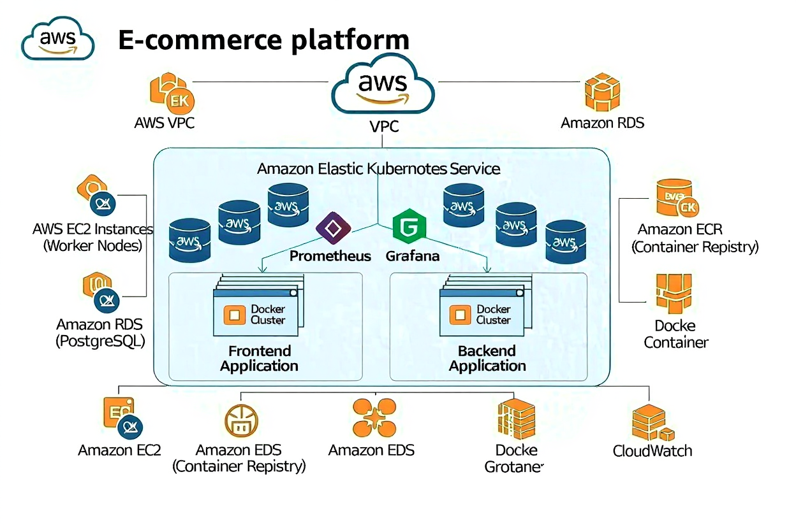

# Cloud-Native E-commerce Platform

[](https://github.com/anasarb1/cloud-native-ecommerce/actions)
[](https://opensource.org/licenses/MIT)
[](https://github.com/anasarb1/cloud-native-ecommerce/actions)
[](https://www.docker.com/)

## Project Summary

As part of my End-to-End DevOps Project, I undertook the task of deploying a secure containerized e-commerce application on AWS infrastructure. This project aimed to leverage Kubernetes for container orchestration while implementing industry best practices for security and continuous integration/continuous deployment (CI/CD).

## Task

To accomplish this, I identified the need for a comprehensive set of tools and technologies to ensure the security and reliability of the infrastructure and application deployments. My task involved selecting and integrating various tools into the project workflow to address key areas such as cloud provisioning, security scanning, containerization, container orchestration, and monitoring.

## Architecture:



_Explanation: This diagram illustrates the high-level architecture of the cloud-native e-commerce platform. It showcases the interaction between the frontend and backend services, the PostgreSQL database, and the various AWS services utilized for infrastructure, CI/CD, and monitoring._

## Quick Start (Local Development)

To get the application running locally using Docker Compose, follow these steps:

1.  **Prerequisites:** Ensure you have Docker and Docker Compose installed on your machine.

2.  **Clone the Repository:**

    ```bash
    git clone https://github.com/anasarb1/cloud-native-ecommerce.git
    cd cloud-native-ecommerce
    ```

3.  **Environment Variables:** Create a `.env` file based on `.env.example` and fill in the necessary environment variables.

4.  **Start the Application:**

    ```bash
    docker-compose up --build
    ```

    This will build the Docker images for the frontend and backend, and start all services, including the PostgreSQL database.

5.  **Access the Application:** Once all services are up and running, you can access the frontend application in your browser at `http://localhost:3000` (or the port specified in your `docker-compose.yml`).

## Cloud Deployment (Terraform + GitHub Actions)

This project supports automated deployment to AWS EKS using Terraform and GitHub Actions. The CI/CD pipeline handles infrastructure provisioning, Docker image building, and Kubernetes deployment.

1.  **AWS Configuration:** Ensure your AWS account is configured with appropriate IAM roles and permissions for GitHub Actions to interact with AWS services (ECR, EKS, etc.) using OIDC.

2.  **Terraform Setup:**

    The Terraform configurations are located in the `terraform/` directory. They define the AWS infrastructure, including VPC, EKS cluster, and other necessary resources.

3.  **GitHub Actions Workflow:**

    The CI/CD workflow is defined in `.github/workflows/ci-cd.yml`. It performs the following steps:
    -   Terraform validation (fmt, init, validate)
    -   Build and push Docker images to AWS ECR
    -   Deploy to EKS cluster using `kubectl apply`

4.  **Triggering Deployment:** Pushing changes to the `main` branch will automatically trigger the CI/CD pipeline, leading to a new deployment.

## Demo

_Placeholder for a short Loom video or GIF demonstrating the application._

## Tech Stack

**Frontend:** React, JavaScript, HTML, CSS
**Backend:** Python, Flask, PostgreSQL
**Containerization:** Docker
**Orchestration:** Kubernetes (EKS)
**Infrastructure as Code:** Terraform
**CI/CD:** GitHub Actions
**Monitoring:** Prometheus, Grafana
**Security:** CodeQL, Dependabot, Snyk, Sonarqube, Trivy

## Features

-   **User Authentication:** Secure user login and registration.
-   **Product Catalog:** Browse and search for products.
-   **Shopping Cart:** Add, remove, and update items in the cart.
-   **Order Management:** Place and track orders.
-   **Payment Integration:** (Placeholder for future payment gateway integration).
-   **Scalable Architecture:** Designed for high availability and scalability on Kubernetes.
-   **Automated CI/CD:** Streamlined development and deployment process.
-   **Comprehensive Monitoring:** Real-time insights into application and infrastructure performance.
-   **Robust Security:** Integrated security scanning and vulnerability management.

## CI/CD Overview

Our CI/CD pipeline leverages GitHub Actions to automate the entire software delivery lifecycle. It ensures code quality, security, and efficient deployment to our Kubernetes cluster on AWS EKS. Key aspects include:

-   **Automated Testing:** Running unit and integration tests.
-   **Static Code Analysis:** Using CodeQL for security vulnerabilities.
-   **Dependency Management:** Automated updates with Dependabot.
-   **Container Image Management:** Building and pushing optimized Docker images to ECR.
-   **Infrastructure Provisioning:** Managing AWS resources with Terraform.
-   **Kubernetes Deployment:** Deploying application updates to EKS.

## Setup Guide

### Prerequisites

Before you begin, ensure you have the following installed and configured:

- AWS CLI configured with appropriate credentials.
- Terraform (v1.0.0+)
- Docker Desktop or Docker Engine
- kubectl
- Git

### Deployment Steps

1.  **Clone the Repository:**

    ```bash
    git clone https://github.com/anasarb1/cloud-native-ecommerce.git
    cd cloud-native-ecommerce
    ```

2.  **Configure AWS Credentials:**

    Ensure your AWS CLI is configured with an IAM user that has programmatic access and sufficient permissions to create and manage EKS clusters, VPCs, RDS instances, and other necessary AWS resources.

3.  **Initialize Terraform:**

    Navigate to the `terraform` directory and initialize Terraform:

    ```bash
    cd terraform
    terraform init
    ```

4.  **Plan and Apply Terraform:**

    Review the execution plan and apply the infrastructure changes:

    ```bash
    terraform plan
    terraform apply --auto-approve
    ```

    This will provision the VPC, EKS cluster, RDS database, and other foundational AWS resources.

5.  **Build and Push Docker Images:**

    Navigate to the `app` directory and build the Docker images for the frontend and backend applications. Replace `YOUR_ECR_REPO_URL` with your actual ECR repository URL.

    ```bash
    cd ../app
    docker build -t YOUR_ECR_REPO_URL/ecommerce-frontend:latest -f ../docker/frontend/Dockerfile .
    docker build -t YOUR_ECR_REPO_URL/ecommerce-backend:latest -f ../docker/backend/Dockerfile .
    docker push YOUR_ECR_REPO_URL/ecommerce-frontend:latest
    docker push YOUR_ECR_REPO_URL/ecommerce-backend:latest
    ```

6.  **Deploy Kubernetes Manifests:**

    Once the EKS cluster is ready and your `kubeconfig` is updated (Terraform will typically handle this), apply the Kubernetes manifests:

    ```bash
    cd ../kubernetes
    kubectl apply -f .
    ```

    This will deploy the frontend, backend, and database services, along with Prometheus and Grafana.

7.  **Access the Application:**

    After deployment, retrieve the ALB URL to access your e-commerce platform:

    ```bash
    kubectl get ingress -n default
    ```

    Look for the `ADDRESS` field in the output.

## Monitoring and Logging

-   **CloudWatch:** Access logs and metrics for AWS services directly from the AWS Management Console.
-   **Prometheus & Grafana:** Access the Grafana dashboard via its service URL (usually exposed through an Ingress or Load Balancer within Kubernetes) to view application metrics.

## Contributing

Contributions are welcome! Please fork the repository and submit pull requests.

## License

This project is licensed under the MIT License.


